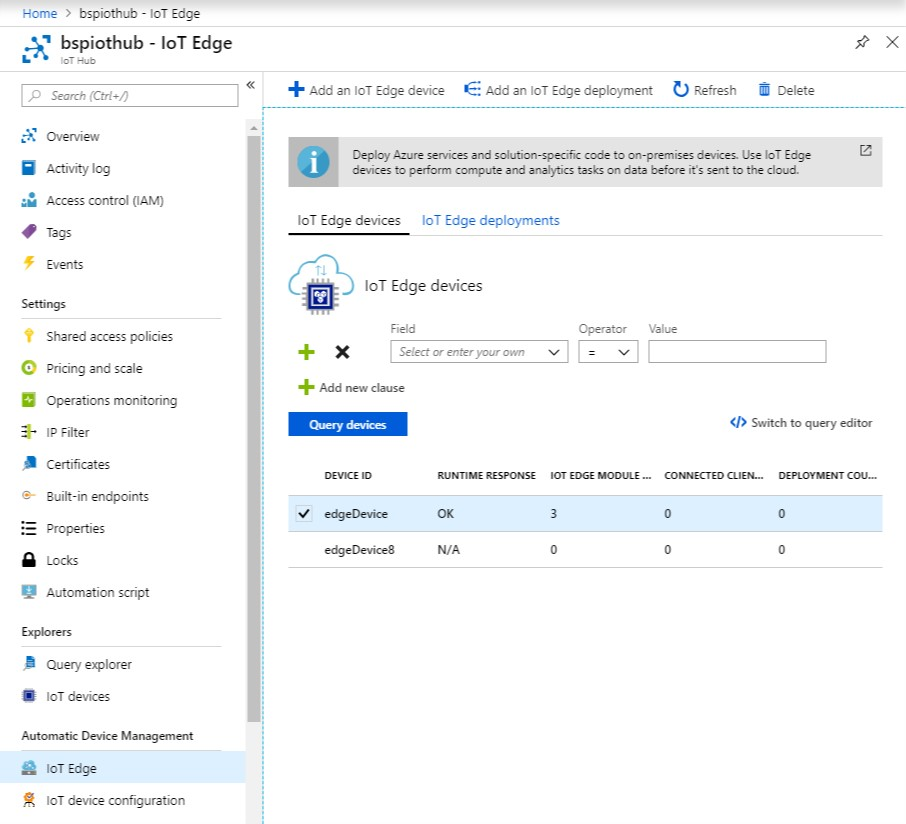

# Azure IoT Edge

Contents

- [Edge Deploy](#Edge-Deploy)
  - Ubuntu
  - Debian
- [Machine Learning Module Deploy](#Machine-Learning-Module-Deploy)


## Edge Deploy

MS Docs : [Linux](https://docs.microsoft.com/en-us/azure/iot-edge/how-to-install-iot-edge-linux), [Windows](https://docs.microsoft.com/en-us/azure/iot-edge/how-to-install-iot-edge-windows)

### Windows 준비

- 준비사항

  - [Window용 Docker 설치 후 Windows 컨테이너로 전환하기](https://docs.microsoft.com/ko-kr/virtualization/windowscontainers/quick-start/quick-start-windows-10)

    - Edge런타임 설치 전에 Docker 엔진이 running 상태인지 확인하기

      

  - Windows 버전 확인

    - 지원되는 Windows 버전
      - [2018년 10월 업데이트 (**빌드 17763**)](https://www.microsoft.com/ko-kr/software-download/windows10)가 적용된 Windows10 또는 IoT Core
      - Windows Server 2019

    - 빌드버전 확인하는 방법

      1. `윈도우키 + R` 실행창 켜기

      2. 실행창에 `winver` 입력

      3. 빌드넘버가 **17763**인지 확인하기 

       	

  - `시작 - Windows 기능 켜기/끄기` 에서 Hyper-V, Containers 기능에 체크되어 있는 지 확인

    

### Ubuntu

### Debian

- curl 등 Ubuntu에서 기본으로 지원하는 기능이 없어 설치해야 함

  ```sh
  sudo apt-get install \
      apt-transport-https \
      ca-certificates \
      curl \
      gnupg2 \
      software-properties-common
  ```

- Debian에 맞는 repository 및 GPG 키 설정

  ```sh
  # Install repository configuration
  curl https://packages.microsoft.com/config/debian/<version>/prod.list > ./microsoft-prod.list
  sudo cp ./microsoft-prod.list /etc/apt/sources.list.d/
  
  # Install Microsoft GPG public key
  curl https://packages.microsoft.com/keys/microsoft.asc | gpg --dearmor > microsoft.gpg
  sudo cp ./microsoft.gpg /etc/apt/trusted.gpg.d/
  
  # Perform apt upgrade
  sudo apt-get upgrade
  ```


## Machine Learning Module Deploy

### Portal에서 Module 배포

Portal에서 Container registry에 등록된 ML Module을 IoT Edge 장비에 배포합니다.

1. IoT Edge가 등록된 IoT Hub로 이동, 모듈을 탑재하고자 하는 Edge Device 선택

   

2. 상단 메뉴에서 `Set Modules` 선택하여 모듈 설정으로 이동

   

3. `Container Registry Settings`에 배포하고자 하는 모듈이 있는 ACR의 정보 입력

   

4. `Deployment Module`에서 `+`버튼을 누르고, `IoT Edge Module` 선택

   

5. 우측에 나타나는 창에 원하는 모듈의 이름과 이미지 경로를 입력하고 저장

   

6. 나머지 사항은 기본 옵션으로 진행하고 배포 수행

