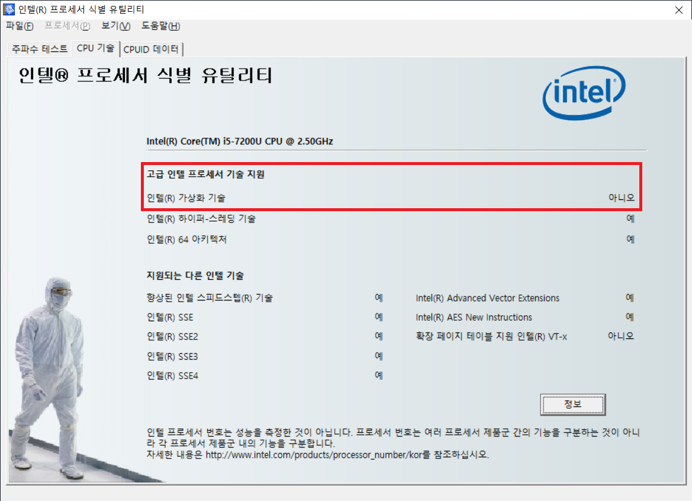

# Docker

## Prerequisite

- 해당 PC의 프로세서가 가상화 기술을 지원하는 지 확인

  1. 인텔 프로세서 식별 유틸리티 [다운로드](https://www.intel.co.kr/content/www/kr/ko/support/articles/000005651/processors.html) 및 설치

  2. 실행 후, CPU 기술 탭에서 가상화 기술 지원 여부 확인

     

## Troubleshooting

- 